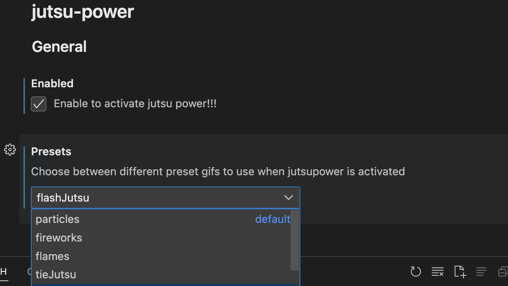
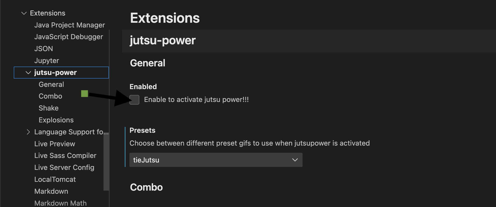

# jutsu-power README

This extension is for anime enthusiasm that want there anime characters on vs code 
(This extension is inspired from **power mode** extension)

## Features
* Anime Characters on writing code
* Strong default settings
* Easily choose from a variety of [built-in effects](#choose-your-explosions)    including  explosions, interdeminsional portals, and clippy. Or quickly edd your own!
* Select Anime 

## Get Start

## Custom Anime
If you want that you custom anime character should be in this extension ,than create gif for your anime and send message [on github](https://github.com/alokesh-git/jutsu-mode)  I will add you custom gif. 

